# Templates/GFX Readme

Please use the template examples in this folder otherwise I'll likely reject any new graphics.
There are/were 50+ (!!!) different settings in the legacy file and I'd rather milk a cow than to have to debug them again with new stuff.

The automated process tags the Template ID onto each pnml file just under the copyright text so you can grab example templates if confused.

The obviously chaotic naming logic is a derivative of attempt to categorise existing legacy images into templates and then ending up with 40+ of them and then grouping the vaguely similar ones.

Here's a flowchart attempt (cue Gemini) if that helps, else try to make sense of the text below.

```mermaid
flowchart TD
    Start["What kind of vehicle is it?"]
    
    EngineType{"Engine Type?"}
    TPL_01A["TPL_01A"]
    TPL_03B["TPL_03B"]
    TPL_03A["TPL_03A"]
    TPL_03E["TPL_03E"]
    TPL_03G["TPL_03G"]
    TPL_03C["TPL_03C"]
    TPL_03D["TPL_03D"]
    TPL_03F["TPL_03F"]
    EngNoAnim{"Dual-Headed?"}
    SteamType{"Steam Details?"}
    SecType{"Secondary Config?"}

    MuType{"MU or Metro?"}
    TPL_02C["TPL_02C"]
    xMuType{"xMU Config?"}
    TPL_02A["TPL_02A"]
    TPL_02D["TPL_02D"]

    WagonType{"Wagon Subtype?"}
    TPL_01F["TPL_01F"]
    TPL_25["TPL_25"]
    TPL_04R["TPL_04R"]
    TPL_04T["TPL_04T"]
    CargoWagon{"Specific Cargo or Gen?"}
    TPL_04C["TPL_04C"]
    TPL_04D["TPL_04D"]
    TPL_04E["TPL_04E"]
    TPL_04F["TPL_04F"]
    TPL_04G["TPL_04G"]
    TPL_04H["TPL_04H"]
    TPL_04I["TPL_04I"]
    TPL_04J["TPL_04J"]
    TPL_04K["TPL_04K"]
    TPL_04L["TPL_04L"]
    TPL_04M["TPL_04M"]
    TPL_04N["TPL_04N"]
    TPL_04O["TPL_04O"]
    TPL_04P["TPL_04P"]
    TPL_04Q["TPL_04Q"]

    CoachType{"Coach Setup?"}
    TPL_04U["TPL_04U"]
    TPL_04A["TPL_04A"]
    TPL_04B["TPL_04B"]

    LenType{"Length?"}
    TPL_016["TPL_016"]
    Len10Type{"10 Length Config?"}
    TPL_32A["TPL_32A"]
    TPL_32D["TPL_32D"]
    TPL_32B["TPL_32B"]
    TPL_32C["TPL_32C"]
    FbOnly["TPL_017A"]

    MultiUnit{"Unit Configuration?"}
    TPL_017B["TPL_017B"]
    TPL_017C["TPL_017C"]
    TPL_017D["TPL_017D"]
    TPL_017E["TPL_017E"]

    SpecialType{"Special Vehicle?"}
    TPL_042A["TPL_042A"]
    TPL_042B["TPL_042B"]
    TPL_042C["TPL_042C"]

    Start --> EngineType
    Start --> MuType
    Start --> WagonType
    Start --> CoachType
    Start --> LenType
    Start --> FbOnly
    Start --> SpecialType
    Start --> MultiUnit

    EngineType --> SteamType
    EngineType --> EngNoAnim
    EngineType --> SecType

    EngNoAnim --> TPL_01A
    EngNoAnim --> TPL_03B

    SteamType --> TPL_03A
    SteamType --> TPL_03E
    SteamType --> TPL_03G

    SecType --> TPL_03B
    SecType --> TPL_03C
    SecType --> TPL_03D
    SecType --> TPL_03F

    MuType --> TPL_02C
    MuType --> xMuType
    
    xMuType --> TPL_02A
    xMuType --> TPL_02D

    WagonType --> TPL_01F
    WagonType --> TPL_25
    WagonType --> TPL_04R
    WagonType --> TPL_04T
    WagonType --> CargoWagon

    CargoWagon --> TPL_04C
    CargoWagon --> TPL_04D
    CargoWagon --> TPL_04E
    CargoWagon --> TPL_04F
    CargoWagon --> TPL_04G
    CargoWagon --> TPL_04H
    CargoWagon --> TPL_04I
    CargoWagon --> TPL_04J
    CargoWagon --> TPL_04K
    CargoWagon --> TPL_04L
    CargoWagon --> TPL_04M
    CargoWagon --> TPL_04N
    CargoWagon --> TPL_04O
    CargoWagon --> TPL_04P
    CargoWagon --> TPL_04Q

    CoachType --> TPL_04U
    CoachType --> TPL_04A
    CoachType --> TPL_04B

    LenType --> TPL_016
    LenType --> Len10Type
    
    Len10Type --> TPL_32A
    Len10Type --> TPL_32D
    Len10Type --> TPL_32B
    Len10Type --> TPL_32C

    MultiUnit --> TPL_017B
    MultiUnit --> TPL_017C
    MultiUnit --> TPL_017D
    MultiUnit --> TPL_017E

    SpecialType --> TPL_042A
    SpecialType --> TPL_042B
    SpecialType --> TPL_042C
```

Most **Engines** _exc Steam_ will fall into `TPL_01`, whichever version of it assuming there is no animation involved. I'd suggest using `TPL_01A`;
If your design is dual-headed, still use that, don't move any of the boxes, for those -> `TPL_03B`. 

Most **xMUs** will be `TPL_02A` if the middle cars are only different pax/mail. `TPL_02D` is for EMUs where the unpowered/powered cars are visually different. Other templates exist but I suggest not using them. There is no `TPL_02B` - it has been removed during testing.

Most **Metros** will be `TPL_02C`.

**Things with secondary items** are usually `TPL_03x`:
- `03A` -> Steam w/ Tender
- `03B` -> Items w/ 2 engine animation states
- `03C` -> Same as B but different 'purchase' position (2nd item will flip/reverse)
- `03D` -> Non-animated articulated engines (2nd item will flip/reverse)
- `03E` -> Same as A but no Visual Effect
- `03F` -> Asymmetrical single-unit engines NOT A/B, Single NOT articulated (2nd item will flip/reverse)
- `03G` -> Same as A but 12 length

For **Wagons**, it's a little chaotic because there are 'simple' (`TPL_01F`) ones with no loading states, then ones with liveries (`TPL_04A`) + loading states (`TPL_04B`) and ones _with liveries + loading states + different sprites per cargo type_

- Box Car Type 1 -> `TPL_04C` (but not Gen 2/3/4 Type 2)
- Box Car Type 2 -> `TPL_04D` (but not Gen 2/3/4 Type 2)
- Centerbeam -> `TPL_04E`
- Container-Carrier -> `TPL_04F`
- Container-Doublestack -> `TPL_04G`
- Hopper Types 1/2 -> `TPL_04H`
- Flatcar/Flat Wagon -> `TPL_04I`
- Tanker Non-2nd Gen -> `TPL_04J`
- Tanker 2nd Gen -> `TPL_04K`
- Open Wagon Gen2/Gen3 -> `TPL_04L` - This has 'Driving State' for GRAIN only
- Box Car Gen3/4 Type 2 -> `TPL_04M`
- Gondola -> `TPL_04N` - This has 'Driving State' for GRAIN only
- Heavy Flatcar -> `TPL_04O`
- Box Car Gen2 Type 2 -> `TPL_04P`
- Superheavy -> `TPL_25` - [not 04x] This has Front/Back/Middle/Articulated + Loading states
- Open Wagon Gen1 -> `TPL_04Q`
- Service Cars -> `TPL_04R`
- ~DC/Push-Pull~ Unused -> `TPL_04S`
- Livestock _only_ wagon -> `TPL_04T`
- Basic Coach Push-Pull and also not Push-Pull -> `TPL_04U`

Basically don't create new types of Wagons. At the moment Gen 6/7 use G5 graphics, it'd be awesome if someone updated those but don't reinvent the wheel please.

**Coaches** are `TPL_04A`, with or without push-pull - Unless you want loading states like the Indian whichever coach that has people hanging on it when full - that's `TPL_04B`. If you are using a simple wagon with no alternatives (like dining coach, first class, that sorta stuff) it's `TPL_04U`, also supports push-pull.

Vehicles with **12 length** use `TPL_016`.
Vehicles with **10 length** use `TPL_032` 
- `32A` for no animation (articulated) and 
- `32B` for with animation. 
- `32C` is the same as `B` but has `length` added to the visualisation switch. 
- `32D` is same as A but no articulation

Things with **front and back but no livery or loading states** use `TPL_017A`.

- For **A/B Front/Back** it's `TPL_017B`
- For **Front 1, Front 2, Middle, Back 1, Back 2** it's `TPL_017C`.
- For **Front 1, Front 2, Middle 1, Middle 2, Back 1, Back 2** it's `TPL_017D`.
- For **Front 1, Front 2, Back 1, Back 2** it's `TPL_017E`.

`TPL_042` are for special vehicles
- `042A`: CargoDMU
- `042B`: M250 CargoEMU
- `042C`: DD CargoEMU

I'd suggest not producing more of them though, it's a little too complex.

You may ofc put your logo on the file(s) but don't move the template boxes. Any new additions will be merged into the existing template image standard.
